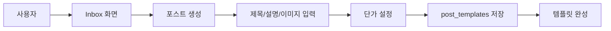
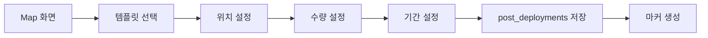
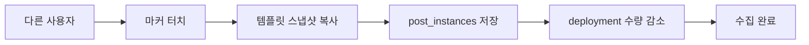

# PPAM Alpha 데이터베이스 구조 문서

## 📊 개요

PPAM Alpha 앱의 Firebase Firestore 데이터베이스 구조를 정의한 문서입니다. 기존 `posts`와 `markers` 컬렉션을 활용하고, 새로운 `post_instances` 컬렉션을 추가하여 포스트 템플릿과 배포/수집 워크플로우를 분리합니다.

## 🎯 핵심 개념

### 1. 포스트 워크플로우 3단계
1. **템플릿 생성**: 사용자가 Inbox에서 포스트 템플릿 생성 (단가만 설정)
2. **마커 배포**: Map에서 템플릿 선택 후 수량/위치/기간 설정하여 배포
3. **인스턴스 수집**: 다른 사용자가 마커를 터치하여 개인 포스트 인스턴스 획득

### 2. 데이터 관계도
```
PostTemplate (템플릿)
    ↓ (1:N)
PostDeployment (배포/마커)
    ↓ (1:N)
PostInstance (개인 인스턴스)
```

## 🗂️ 컬렉션 구조

### 1. `post_templates` - 포스트 템플릿
**용도**: 사용자가 생성한 포스트 템플릿 (콘텐츠 + 단가)

```javascript
{
  "templateId": "template_12345",
  "creatorId": "user_abc123",
  "creatorName": "김철수",
  "createdAt": "2025-01-15T09:00:00Z",

  // 핵심 콘텐츠
  "title": "맛있는 치킨집 할인쿠폰",
  "description": "오늘 하루만 20% 할인!",
  "reward": 500,  // 단가 (포인트)

  // 미디어
  "mediaType": ["image", "text"],
  "mediaUrl": ["https://storage.../chicken.jpg"],
  "thumbnailUrl": ["https://storage.../chicken_thumb.jpg"],

  // 타겟팅 조건
  "targetAge": [20, 40],
  "targetGender": "all",
  "targetInterest": ["음식", "할인"],
  "targetPurchaseHistory": ["치킨", "배달음식"],

  // 행동 옵션
  "canRespond": true,
  "canForward": true,
  "canRequestReward": true,
  "canUse": true,

  // 상태 및 통계
  "status": "active",  // active, inactive, deleted
  "totalDeployments": 3,  // 배포된 횟수
  "totalInstances": 25,   // 생성된 인스턴스 수
  "lastDeployedAt": "2025-01-15T10:30:00Z",

  // 쿠폰 시스템 (선택)
  "isCoupon": true,
  "couponData": {
    "type": "discount",
    "value": 20,
    "unit": "percent"
  }
}
```

**주요 특징**:
- ❌ **생성일/만료일 없음**: 템플릿 단계에서는 시간 제약 없음
- ❌ **위치/수량 정보 없음**: 배포 시에만 결정
- ✅ **단가만 존재**: `reward` 필드로 포인트 단가만 설정
- ✅ **재사용 가능**: 같은 템플릿으로 여러 번 배포 가능

### 2. `post_deployments` - 배포 정보 (마커)
**용도**: 특정 템플릿의 배포 정보 (위치, 수량, 기간)

```javascript
{
  "deploymentId": "deploy_67890",
  "templateId": "template_12345",  // 원본 템플릿 참조
  "creatorId": "user_abc123",

  // 배포 위치 (Map에서 설정)
  "location": {
    "_latitude": 37.5665,
    "_longitude": 126.9780
  },
  "radius": 1000,  // 노출 반경 (미터)

  // 배포 수량 (Map에서 설정)
  "totalQuantity": 10,      // 총 배포 수량
  "remainingQuantity": 7,    // 남은 수량
  "collectedQuantity": 3,    // 수집된 수량

  // 배포 기간 (Map에서 설정)
  "startDate": "2025-01-15T10:00:00Z",
  "endDate": "2025-01-22T10:00:00Z",
  "deployedAt": "2025-01-15T10:30:00Z",

  // 마커 상태
  "status": "active",  // active, expired, paused, deleted
  "markerId": "marker_user_abc123_template_12345_deploy_67890",

  // 성능 최적화
  "tileId": "tile_123_456",
  "s2_10": "s2cell_level10_id",
  "s2_12": "s2cell_level12_id",
  "isSuperPost": false,

  // 통계
  "viewCount": 15,
  "collectionRate": 0.3  // 30% 수집률
}
```

**주요 특징**:
- ✅ **템플릿 참조**: `templateId`로 원본 템플릿과 연결
- ✅ **배포 설정**: 위치, 수량, 기간을 Map에서 설정
- ✅ **실시간 수량 관리**: 수집될 때마다 `remainingQuantity` 감소
- ✅ **마커 ID**: 지도에 표시되는 고유 마커 식별자

### 3. `post_instances` - 개인 포스트 인스턴스
**용도**: 사용자가 수집한 개별 포스트 (템플릿의 스냅샷 복사본)

```javascript
{
  "instanceId": "instance_xyz789",
  "templateId": "template_12345",    // 원본 템플릿 참조
  "deploymentId": "deploy_67890",    // 배포 정보 참조
  "userId": "user_def456",           // 수집한 사용자

  // 수집 정보
  "collectedAt": "2025-01-15T14:20:00Z",
  "collectedLocation": {
    "_latitude": 37.5665,
    "_longitude": 126.9780
  },

  // 사용 정보
  "usedAt": null,
  "usedLocation": null,
  "usedNote": null,

  // 인스턴스 상태
  "status": "collected",  // collected, used, expired, deleted

  // 템플릿 데이터 스냅샷 (수집 시점의 복사본)
  "creatorId": "user_abc123",
  "creatorName": "김철수",
  "title": "맛있는 치킨집 할인쿠폰",
  "description": "오늘 하루만 20% 할인!",
  "reward": 500,
  "mediaType": ["image", "text"],
  "mediaUrl": ["https://storage.../chicken.jpg"],
  "thumbnailUrl": ["https://storage.../chicken_thumb.jpg"],

  // 타겟팅 정보 (스냅샷)
  "targetAge": [20, 40],
  "targetGender": "all",
  "targetInterest": ["음식", "할인"],
  "targetPurchaseHistory": ["치킨", "배달음식"],

  // 행동 옵션 (스냅샷)
  "canRespond": true,
  "canForward": true,
  "canRequestReward": true,
  "canUse": true,

  // 만료 정보 (배포에서 복사)
  "expiresAt": "2025-01-22T10:00:00Z",

  // 전달/응답 관련
  "forwardedFrom": null,
  "forwardedAt": null,
  "responses": [],

  // 쿠폰 정보 (스냅샷)
  "isCoupon": true,
  "couponData": {
    "type": "discount",
    "value": 20,
    "unit": "percent"
  }
}
```

**주요 특징**:
- ✅ **완전한 스냅샷**: 수집 시점의 템플릿 데이터를 모두 복사
- ✅ **독립적 관리**: 원본 템플릿 변경에 영향받지 않음
- ✅ **사용자별 상태**: 개별 사용/만료 관리
- ✅ **만료일 적용**: 배포의 `endDate`를 `expiresAt`으로 복사

## 🔄 워크플로우 상세

### 1. 템플릿 생성 (Inbox)


**설정 항목**:
- 콘텐츠: 제목, 설명, 이미지
- 단가: 포인트 리워드
- 타겟팅: 연령, 성별, 관심사
- 행동 옵션: 응답/전달/리워드요청/사용 가능 여부

### 2. 마커 배포 (Map)


**설정 항목**:
- 위치: GPS 좌표, 노출 반경
- 수량: 총 배포 수량
- 기간: 시작일, 종료일

### 3. 포스트 수집 (Map)


**생성 데이터**:
- 템플릿 전체 데이터 복사
- 수집 시점/위치 기록
- 배포 만료일을 인스턴스 만료일로 적용

## 📈 기존 컬렉션과의 관계

### 기존 컬렉션들 (마이그레이션 대상)

#### `posts` (기존)
- **문제점**: 템플릿과 인스턴스가 혼재
- **해결책**: 데이터를 분석하여 3개 컬렉션으로 분리

#### `post_collections` (기존)
- **문제점**: 참조만 저장, 실제 데이터 복사 없음
- **해결책**: `post_instances`로 대체 (완전한 스냅샷)

#### `post_usage` (기존)
- **유지**: 포인트 지급 및 사용 기록 관리
- **연동**: `post_instances`의 `usedAt` 필드와 연동

#### `flyers` (기존)
- **분석 필요**: 용도 확인 후 마이그레이션 또는 제거

## 🔍 쿼리 패턴

### 내 포스트 템플릿 조회
```javascript
// Inbox "내 포스트" 탭
db.collection('post_templates')
  .where('creatorId', '==', userId)
  .where('status', 'in', ['active', 'inactive'])
  .orderBy('createdAt', 'desc')
```

### 내가 수집한 포스트 조회
```javascript
// Inbox "받은 포스트" 탭
db.collection('post_instances')
  .where('userId', '==', userId)
  .where('status', 'in', ['collected', 'used'])
  .orderBy('collectedAt', 'desc')
```

### 지도에서 마커 조회
```javascript
// Map 화면 - 활성 마커들
db.collection('post_deployments')
  .where('status', '==', 'active')
  .where('endDate', '>', new Date())
  .where('remainingQuantity', '>', 0)
  .where('s2_10', 'in', s2CellIds)  // 지역 필터링
```

### 템플릿 배포 현황 조회
```javascript
// 특정 템플릿의 모든 배포 현황
db.collection('post_deployments')
  .where('templateId', '==', templateId)
  .orderBy('deployedAt', 'desc')
```

## 🚀 마이그레이션 전략

### Phase 1: 새 컬렉션 생성
1. `post_templates`, `post_deployments`, `post_instances` 컬렉션 생성
2. 새로운 모델 클래스 적용
3. 새 서비스 클래스 개발

### Phase 2: 데이터 분석 및 분류
1. 기존 `posts` 데이터 분석
2. 템플릿 vs 인스턴스 구분
3. 배포 정보 추출

### Phase 3: 점진적 마이그레이션
1. 새로운 포스트는 새 구조로 생성
2. 기존 데이터 단계별 마이그레이션
3. 양방향 호환성 유지

### Phase 4: 완전 전환
1. 모든 기능을 새 구조로 전환
2. 기존 컬렉션 정리
3. 성능 최적화

## 🔧 인덱스 설정

### 필수 인덱스

#### `post_templates`
```javascript
// 내 템플릿 조회용
{ "creatorId": 1, "createdAt": -1 }
{ "creatorId": 1, "status": 1, "createdAt": -1 }
```

#### `post_deployments`
```javascript
// 지역별 활성 마커 조회용
{ "status": 1, "endDate": 1, "s2_10": 1 }
{ "status": 1, "remainingQuantity": 1, "s2_10": 1 }

// 템플릿별 배포 조회용
{ "templateId": 1, "deployedAt": -1 }
```

#### `post_instances`
```javascript
// 사용자별 수집 포스트 조회용
{ "userId": 1, "collectedAt": -1 }
{ "userId": 1, "status": 1, "collectedAt": -1 }

// 템플릿별 인스턴스 조회용
{ "templateId": 1, "collectedAt": -1 }
```

## 📊 통계 및 분석

### 템플릿 성과 분석
- 총 배포 횟수 (`totalDeployments`)
- 총 수집 인스턴스 수 (`totalInstances`)
- 수집률 = 수집된 인스턴스 / 총 배포 수량

### 배포 성과 분석
- 수집률 (`collectionRate`)
- 노출 대비 수집률 (`collectedQuantity / viewCount`)
- 지역별/시간대별 성과

### 사용자 행동 분석
- 수집 패턴 (시간, 위치, 카테고리)
- 사용률 (수집 후 실제 사용 비율)
- 전달/응답 활동

---

**문서 버전**: v1.0
**마지막 업데이트**: 2025-01-15
**작성자**: Claude Code Assistant