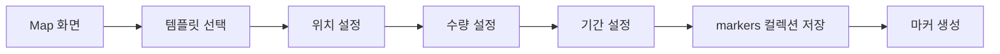

# PPAM Alpha 데이터베이스 구조 문서 (수정판)

## 📊 개요

PPAM Alpha 앱의 Firebase Firestore 데이터베이스 구조를 정의한 문서입니다. **기존 `posts`와 `markers` 컬렉션을 유지**하고, 새로운 `post_instances` 컬렉션만 추가하여 포스트 템플릿과 배포/수집 워크플로우를 개선합니다.

## 🎯 핵심 개념

### 1. 포스트 워크플로우 3단계
1. **템플릿 생성**: 사용자가 Inbox에서 포스트 템플릿 생성 (단가만 설정)
2. **마커 배포**: Map에서 템플릿 선택 후 수량/위치/기간 설정하여 마커 배포
3. **인스턴스 수집**: 다른 사용자가 마커를 터치하여 개인 포스트 인스턴스 획득

### 2. 데이터 관계도
```
posts (포스트 템플릿) ✅ 기존 유지
    ↓ (1:N)
markers (배포된 마커) ✅ 기존 유지
    ↓ (1:N)
post_instances (개인 인스턴스) 🆕 신규 생성
```

## 🗂️ 컬렉션 구조 (기존 + 신규)

### 1. `posts` - 포스트 템플릿 ✅ 기존 유지
**용도**: 사용자가 생성한 포스트 템플릿 (콘텐츠 + 단가)
**현재 상태**: 이미 구현되어 있음
**수정 필요**: 생성일/만료일 관련 로직 제거

```javascript
{
  "postId": "post_12345",
  "creatorId": "user_abc123",
  "creatorName": "김철수",
  "createdAt": "2025-01-15T09:00:00Z", // 템플릿 생성일만 유지

  // 핵심 콘텐츠
  "title": "맛있는 치킨집 할인쿠폰",
  "description": "오늘 하루만 20% 할인!",
  "reward": 500,  // 단가 (포인트)

  // 미디어
  "mediaType": ["image", "text"],
  "mediaUrl": ["https://storage.../chicken.jpg"],
  "thumbnailUrl": ["https://storage.../chicken_thumb.jpg"],

  // 타겟팅 조건
  "targetAge": [20, 40],
  "targetGender": "all",
  "targetInterest": ["음식", "할인"],
  "targetPurchaseHistory": ["치킨", "배달음식"],

  // 행동 옵션
  "canRespond": true,
  "canForward": true,
  "canRequestReward": true,
  "canUse": true,

  // ❌ 제거할 필드들:
  // "expiresAt": 만료일 제거 (배포 시에 결정)
  // "location": 위치 제거 (마커에서 결정)
  // "radius": 반경 제거 (마커에서 결정)
  // "quantity": 수량 제거 (마커에서 결정)

  // 상태 및 통계
  "status": "active",  // active, inactive, deleted
  "isActive": true,
  "totalDeployments": 0,  // 배포된 횟수 (새로 추가)
  "totalInstances": 0,    // 생성된 인스턴스 수 (새로 추가)

  // 쿠폰 시스템 (선택)
  "isCoupon": true,
  "couponData": {
    "type": "discount",
    "value": 20,
    "unit": "percent"
  }
}
```

**주요 특징**:
- ✅ **기존 구조 유지**: 현재 PostService와 호환
- ❌ **만료일 제거**: `expiresAt` 필드 사용 중단
- ❌ **위치/수량 정보 제거**: 마커 배포 시에만 설정
- ✅ **단가 중심**: `reward` 필드로 포인트 단가만 관리
- ✅ **재사용 가능**: 같은 템플릿으로 여러 번 배포 가능

### 2. `markers` - 배포된 마커 ✅ 기존 유지
**용도**: 특정 템플릿의 배포 정보 (위치, 수량, 기간)
**현재 상태**: 이미 구현되어 있음
**수정 필요**: posts 연동 로직 개선

```javascript
{
  "markerId": "marker_67890",
  "postId": "post_12345",  // 원본 템플릿 참조
  "creatorId": "user_abc123",

  // 배포 위치 (Map에서 설정)
  "location": {
    "_latitude": 37.5665,
    "_longitude": 126.9780
  },
  "radius": 1000,  // 노출 반경 (미터)

  // 배포 수량 (Map에서 설정)
  "totalQuantity": 10,      // 총 배포 수량
  "remainingQuantity": 7,   // 남은 수량
  "collectedQuantity": 3,   // 수집된 수량

  // 배포 기간 (Map에서 설정)
  "startDate": "2025-01-15T10:00:00Z",
  "endDate": "2025-01-22T10:00:00Z",
  "createdAt": "2025-01-15T10:30:00Z", // 마커 생성일

  // 마커 상태
  "isActive": true,
  "status": "active",  // active, expired, paused, deleted

  // 성능 최적화 (기존 유지)
  "tileId": "tile_123_456",
  "s2_10": "s2cell_level10_id",
  "s2_12": "s2cell_level12_id",
  "isSuperPost": false,

  // 통계
  "viewCount": 15,
  "collectionRate": 0.3  // 30% 수집률
}
```

**주요 특징**:
- ✅ **기존 MarkerService 유지**: 현재 마커 관련 로직 그대로 사용
- ✅ **배포 설정 완료**: 위치, 수량, 기간을 Map에서 설정
- ✅ **실시간 수량 관리**: 수집될 때마다 `remainingQuantity` 감소
- ✅ **지도 연동 완료**: 기존 지도 시스템과 호환

### 3. `post_instances` - 개인 포스트 인스턴스 🆕 신규 생성
**용도**: 사용자가 수집한 개별 포스트 (템플릿의 스냅샷 복사본)
**현재 상태**: 새로 생성 필요
**대체 대상**: 기존 `post_collections` (참조 → 스냅샷)

```javascript
{
  "instanceId": "instance_xyz789",
  "postId": "post_12345",        // 원본 템플릿 참조 (posts)
  "markerId": "marker_67890",    // 배포 마커 참조 (markers)
  "userId": "user_def456",       // 수집한 사용자

  // 수집 정보
  "collectedAt": "2025-01-15T14:20:00Z",
  "collectedLocation": {
    "_latitude": 37.5665,
    "_longitude": 126.9780
  },

  // 사용 정보
  "usedAt": null,
  "usedLocation": null,
  "usedNote": null,
  "isUsed": false,

  // 인스턴스 상태
  "status": "collected",  // collected, used, expired, deleted
  "isActive": true,

  // 템플릿 데이터 스냅샷 (수집 시점의 복사본)
  "creatorId": "user_abc123",
  "creatorName": "김철수",
  "title": "맛있는 치킨집 할인쿠폰",
  "description": "오늘 하루만 20% 할인!",
  "reward": 500,
  "mediaType": ["image", "text"],
  "mediaUrl": ["https://storage.../chicken.jpg"],
  "thumbnailUrl": ["https://storage.../chicken_thumb.jpg"],

  // 타겟팅 정보 (스냅샷)
  "targetAge": [20, 40],
  "targetGender": "all",
  "targetInterest": ["음식", "할인"],
  "targetPurchaseHistory": ["치킨", "배달음식"],

  // 행동 옵션 (스냅샷)
  "canRespond": true,
  "canForward": true,
  "canRequestReward": true,
  "canUse": true,

  // 만료 정보 (마커에서 복사)
  "expiresAt": "2025-01-22T10:00:00Z", // 마커의 endDate

  // 전달/응답 관련
  "forwardedFrom": null,
  "forwardedAt": null,
  "responses": [],

  // 쿠폰 정보 (스냅샷)
  "isCoupon": true,
  "couponData": {
    "type": "discount",
    "value": 20,
    "unit": "percent"
  }
}
```

**주요 특징**:
- 🆕 **완전 신규 컬렉션**: 기존 시스템에 영향 없음
- ✅ **완전한 스냅샷**: 수집 시점의 템플릿 데이터를 모두 복사
- ✅ **독립적 관리**: 원본 템플릿 변경에 영향받지 않음
- ✅ **만료일 적용**: 마커의 `endDate`를 `expiresAt`으로 복사
- ✅ **기존 대체**: `post_collections` 컬렉션 기능을 완전 대체

## 🔄 워크플로우 상세

### 1. 템플릿 생성 (Inbox) - 기존 유지


**기존 PostService 사용**:
- `createPost()` 메서드 활용
- 만료일 관련 파라미터만 제거

### 2. 마커 배포 (Map) - 기존 유지


**기존 MarkerService 사용**:
- `createMarker()` 메서드 활용
- posts와 markers 연동 개선

### 3. 포스트 수집 (Map) - 신규 구현 필요


**새로운 PostInstanceService 필요**:
- `collectPost()` 메서드 구현
- 템플릿 → 인스턴스 복사 로직

## 📈 기존 컬렉션과의 관계

### 유지되는 컬렉션들

#### `posts` ✅ 유지
- **역할**: 포스트 템플릿
- **수정사항**: 만료일 관련 로직만 제거
- **호환성**: 기존 PostService 그대로 사용

#### `markers` ✅ 유지
- **역할**: 배포된 마커
- **수정사항**: posts 연동 로직 개선
- **호환성**: 기존 MarkerService 그대로 사용

#### `post_usage` ✅ 유지
- **역할**: 포인트 지급 및 사용 기록 관리
- **연동**: `post_instances`의 `usedAt` 필드와 연동

### 대체되는 컬렉션들

#### `post_collections` → `post_instances` 🔄 점진적 대체
- **문제점**: 참조만 저장, 실제 데이터 복사 없음
- **해결책**: `post_instances`로 완전 대체 (스냅샷 방식)
- **마이그레이션**: 기존 데이터를 새 구조로 변환

#### `flyers` 📋 분석 필요
- **현재**: 일부 포스트 데이터 저장
- **계획**: 용도 확인 후 마이그레이션 또는 제거

## 🔍 쿼리 패턴 (기존 + 신규)

### 내 포스트 템플릿 조회 (기존 유지)
```javascript
// Inbox "내 포스트" 탭 - 기존 PostService 사용
db.collection('posts')
  .where('creatorId', '==', userId)
  .where('isActive', '==', true)
  .orderBy('createdAt', 'desc')
```

### 내가 수집한 포스트 조회 (신규)
```javascript
// Inbox "받은 포스트" 탭 - 새로운 PostInstanceService 사용
db.collection('post_instances')
  .where('userId', '==', userId)
  .where('status', 'in', ['collected', 'used'])
  .orderBy('collectedAt', 'desc')
```

### 지도에서 마커 조회 (기존 유지)
```javascript
// Map 화면 - 기존 MarkerService 사용
db.collection('markers')
  .where('isActive', '==', true)
  .where('endDate', '>', new Date())
  .where('remainingQuantity', '>', 0)
  .where('s2_10', 'in', s2CellIds)
```

### 템플릿-마커 연동 조회 (개선)
```javascript
// 특정 템플릿의 모든 마커 현황
db.collection('markers')
  .where('postId', '==', postId)
  .where('isActive', '==', true)
  .orderBy('createdAt', 'desc')
```

## 🚀 구현 전략

### Phase 1: 최소 변경으로 신규 기능 추가
1. **PostInstanceModel 생성** ✅ 완료
2. **PostInstanceService 생성** - 새로운 인스턴스 관리
3. **수집 워크플로우 구현** - 마커 → 인스턴스 생성
4. **Inbox 받은 포스트 연동** - 기존 post_collections 대신 post_instances 사용

### Phase 2: 기존 시스템 개선
1. **PostModel 정리** - 만료일 관련 필드 제거
2. **PostService 개선** - 템플릿 중심 로직으로 변경
3. **MarkerService 연동** - posts와 markers 관계 개선

### Phase 3: 점진적 마이그레이션
1. **post_collections → post_instances** 데이터 마이그레이션
2. **양방향 호환성 유지** - 기존 앱과 신규 앱 동시 지원
3. **성능 최적화** - 새로운 인덱스 생성

### Phase 4: 완전 전환
1. **모든 기능을 새 구조로 전환**
2. **레거시 컬렉션 정리**
3. **최종 성능 최적화**

## 🔧 인덱스 설정

### 기존 인덱스 유지

#### `posts`
```javascript
// 기존 인덱스 그대로 사용
{ "creatorId": 1, "createdAt": -1 }
{ "creatorId": 1, "isActive": 1 }
```

#### `markers`
```javascript
// 기존 인덱스 그대로 사용
{ "isActive": 1, "endDate": 1, "s2_10": 1 }
{ "postId": 1, "isActive": 1 }
```

### 신규 인덱스 추가

#### `post_instances` 🆕
```javascript
// 새로 생성할 인덱스
{ "userId": 1, "collectedAt": -1 }
{ "userId": 1, "status": 1, "collectedAt": -1 }
{ "postId": 1, "collectedAt": -1 }
{ "markerId": 1, "collectedAt": -1 }
```

## 📊 통계 및 분석

### 템플릿 성과 분석
- `posts.totalDeployments` - 총 배포 횟수
- `posts.totalInstances` - 총 수집 인스턴스 수
- 수집률 = 총 인스턴스 수 / 총 배포 수량

### 마커 성과 분석 (기존 유지)
- `markers.collectionRate` - 수집률
- 노출 대비 수집률 (`collectedQuantity / viewCount`)
- 지역별/시간대별 성과

### 사용자 행동 분석
- 수집 패턴 (시간, 위치, 카테고리)
- 사용률 (수집 후 실제 사용 비율)
- 전달/응답 활동

## 🔍 Firebase MCP 연동

### 설치 및 설정
```bash
# Firebase MCP 서버 설치 ✅ 완료
npm install -g @gannonh/firebase-mcp

# Claude Code에 MCP 서버 추가 ✅ 완료
claude mcp add firebase npx @gannonh/firebase-mcp

# Firebase 프로젝트 확인 ✅ 완료
Project: ppamproto-439623 (current)
```

### 활용 가능한 기능
- Firestore 컬렉션 직접 조회/수정
- 실시간 데이터 모니터링
- 인덱스 상태 확인
- 보안 규칙 검증

---

**문서 버전**: v2.0 (기존 구조 반영)
**마지막 업데이트**: 2025-09-26
**작성자**: Claude Code Assistant
**주요 변경사항**: 기존 posts/markers 컬렉션 유지, post_instances만 신규 추가